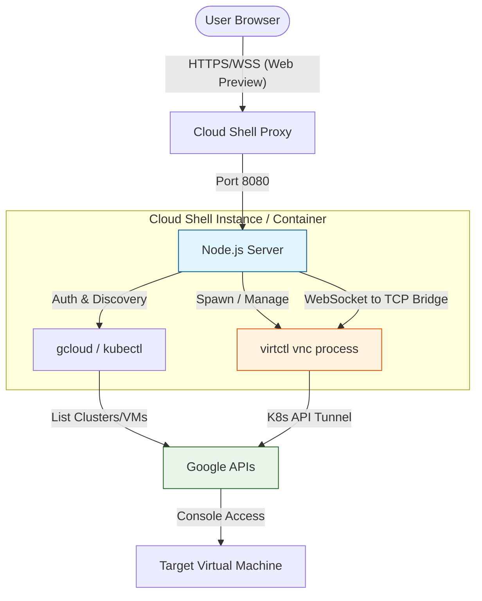

# GDC Remote VM Access

This project allows you to access GDC VMRuntime (VMR) consoles via VNC directly from your browser using Google Cloud Shell. It uses `noVNC` and a Node.js proxy server to bridge the VNC connection to a web interface.

## Architecture



## Prerequisites

- Access to a GDC connected cluster with KubeVirt.
- `gcloud` and `kubectl` configured in Cloud Shell.

## Usage (Docker)

You can run the tool as a container. This bundles all dependencies and only requires `docker` to be installed.

### 1. Build the image
```bash
export IMAGE_PATH=gcr.io/your-project-id/gdc-remote-vm-access
docker build -t $IMAGE_PATH .
```

### 2. Run the container
To allow the container to use your Cloud Shell identity, you must mount your `gcloud` configuration directory.

```bash
docker run -it --rm --init -p 8080:8080 \
  -v ~/.config/gcloud:/root/.config/gcloud \
  $IMAGE_PATH \
  $PROJECT_ID $CLUSTER_NAME $VM_NAME $NAMESPACE
```

**Note:** The container will automatically run `gcloud container fleet memberships get-credentials` using your mounted credentials.

## Web Interface

Once started (via script or Docker):
- Click the **Web Preview** button (top right of Cloud Shell).
- Select **Preview on port 8080**.
- Your browser will open the noVNC interface.
- Click **Connect** (or it might connect automatically).

## Local Development

### Local Setup

1. Clone or copy these files to your Cloud Shell.
2. Run the installation script:
   ```bash
   ./install.sh
   ```

### Local Usage (Direct Script)

1. Authenticate to your cluster:
   ```bash
   gcloud container fleet memberships get-credentials $CLUSTER_NAME
   ```

2. Start the VNC bridge:
   ```bash
   ./start-vnc.sh <VM_NAME> [NAMESPACE]
   ```

## Disclaimer

This project is not an official Google project. It is not supported by
Google and Google specifically disclaims all warranties as to its quality,
merchantability, or fitness for a particular purpose.